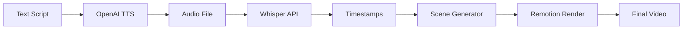

# GitHub README Enhancement Suggestions

## Current Issues
1. README is Chinese-first (limits international reach)
2. No demo video/GIF at top
3. Security warning dominates above-the-fold
4. Missing quick value proposition
5. No visual examples of output
6. Installation steps are buried

## Recommended Structure

### 1. Hero Section (First 3 Seconds)

```markdown
# OpenClaw Video Generator

**Generate professional videos from text in 3 minutes - for less than 1 cent per video**

<div align="center">
  

  <p>
    <a href="https://www.npmjs.com/package/openclaw-video-generator">
      
    </a>
    <a href="https://github.com/ZhenRobotics/openclaw-video-generator/blob/main/LICENSE">
      
    </a>
    <a href="https://github.com/ZhenRobotics/openclaw-video-generator/stargazers">
      
    </a>
  </p>
</div>

> Automated video generation pipeline with OpenAI TTS, Whisper, and Remotion. Perfect for developers who need demo videos, content creators scaling their output, and marketers creating ad variations.

**[Try it now](#quick-start)** • **[Watch Demo](https://youtube.com/...)** • **[Read Tutorial](docs/TUTORIAL.md)**

[English](#) | [中文](README_CN.md)
```

### 2. Show, Don't Tell Section

```markdown
## See It In Action

### Input (Text Script)
```txt
Three tech giants said the same thing on the same day.
Microsoft said Copilot can write 90% of code.
OpenAI said GPT-5 can replace most programmers.
Google said Gemini 2.0 changes the game.
But what's the truth?
AI won't replace developers - it makes great developers 10x more efficient.
Follow me to learn AI tools.
```

### Output (Professional Video)
<div align="center">
  
  <p><em>Generated in 3 minutes • Cost: $0.003 • Resolution: 1080x1920</em></p>
</div>

### One Command
```bash
openclaw-video-generator generate "Your script here"
```

That's it. No editing. No design skills. No expensive tools.
```

### 3. Why Choose This? (Value Props)

```markdown
## Why OpenClaw Video Generator?

<table>
<tr>
<td width="50%">

### Traditional Video Creation
- 2-4 hours per video
- $50-500 per video (freelancer)
- Requires editing skills
- Hard to iterate/update
- Expensive tools ($30-50/mo)

</td>
<td width="50%">

### OpenClaw Video Generator
- 3 minutes per video
- $0.003 per video
- No skills needed
- Update instantly
- Open source + cheap APIs

</td>
</tr>
</table>

### Key Features

- **Lightning Fast**: Text to video in 3 minutes with automated pipeline
- **Incredibly Cheap**: ~$0.003 per 15-second video (100x cheaper than alternatives)
- **Professional Quality**: Cyber-wireframe aesthetic with glitch effects and neon colors
- **Multi-Provider TTS**: OpenAI, Azure, Aliyun, Tencent - use what you prefer
- **Smart Agent**: Natural language interface - just describe what you want
- **Fully Automated**: TTS → Timestamps → Scene Generation → Rendering, all automatic
- **Customizable**: Modify colors, animations, layouts, and scene types
- **Developer-Friendly**: CLI, Agent, or programmatic API
```

### 4. Quick Start (Ultra-Simplified)

```markdown
## Quick Start

### Install (30 seconds)
```bash
npm install -g openclaw-video-generator
export OPENAI_API_KEY="sk-your-key-here"
```

### Generate Your First Video (3 minutes)
```bash
openclaw-video-generator generate "Your amazing script here"
```

### Watch the Result
```bash
# Video saved to: out/generated.mp4
```

**That's it!** You just created a professional video.

### Want More Control?

```bash
# Custom voice and speed
openclaw-video-generator generate "Your script" --voice nova --speed 1.2

# With background video
openclaw-video-generator generate "Your script" --bg-video background.mp4 --bg-opacity 0.4

# Get help
openclaw-video-generator --help
```

**→ [Full Tutorial](docs/TUTORIAL.md)** | **→ [Video Guide](https://youtube.com/...)**
```

### 5. Use Cases with Examples

```markdown
## Use Cases

### For Developers
**Problem**: Need demo videos for GitHub repos but can't afford editors
**Solution**: Generate professional demos in minutes

```bash
openclaw-video-generator generate "Check out my new React library. It makes state management simple. Install with npm. See the docs for examples."
```

### For Content Creators
**Problem**: Video production bottleneck limits output
**Solution**: Scale to 10x content with automation

```bash
# Generate 10 videos in batch
for topic in "AI tools" "Web dev" "Design tips"; do
  openclaw-video-generator generate "Today's tip: $topic..."
done
```

### For Marketers
**Problem**: Need daily social videos but limited budget
**Solution**: Create unlimited ad variations at 1 cent each

```bash
# A/B test different scripts
openclaw-video-generator generate "Version A: Special offer..."
openclaw-video-generator generate "Version B: Limited time..."
```

### For Educators
**Problem**: Course video updates require re-recording everything
**Solution**: Update course videos in minutes

```bash
openclaw-video-generator generate "Lesson 5 updated: New framework features..."
```
```

### 6. Visual Examples Gallery

```markdown
## Example Outputs

<table>
<tr>
<td width="33%">
  
  <p align="center"><strong>Tech Tutorial</strong><br/>Voice: alloy, Speed: 1.0</p>
</td>
<td width="33%">
  
  <p align="center"><strong>Marketing Video</strong><br/>Voice: nova, Speed: 1.3</p>
</td>
<td width="33%">
  
  <p align="center"><strong>Educational Content</strong><br/>Voice: onyx, Speed: 1.0</p>
</td>
</tr>
</table>

**[View More Examples →](docs/EXAMPLES.md)**
```

### 7. Technical Details (For Engineers)

```markdown
## How It Works



### Architecture
- **TTS**: OpenAI TTS API / Azure / Aliyun / Tencent (configurable)
- **Timestamps**: OpenAI Whisper API for precise segmentation
- **Scene Detection**: Smart detection of title/emphasis/pain/content/end scenes
- **Rendering**: Remotion (React-based video renderer)
- **Visual Style**: Cyber-wireframe with glitch effects, neon colors, grid backgrounds

### Tech Stack
- Node.js 18+
- TypeScript
- Remotion 4.0+
- OpenAI API
- FFmpeg

**[Architecture Details →](docs/ARCHITECTURE.md)**
```

### 8. Installation Options (Choose Your Path)

```markdown
## Installation

Choose the method that fits your needs:

<table>
<tr>
<th>Method</th>
<th>Best For</th>
<th>Pros</th>
<th>Installation</th>
</tr>
<tr>
<td><strong>npm Global</strong></td>
<td>Quick usage, end users</td>
<td>One command, globally available</td>
<td>

```bash
npm install -g openclaw-video-generator
```

</td>
</tr>
<tr>
<td><strong>Git Clone</strong></td>
<td>Developers, customization</td>
<td>Full source access, easy to modify</td>
<td>

```bash
git clone https://github.com/ZhenRobotics/openclaw-video-generator.git
cd openclaw-video-generator
npm install
```

</td>
</tr>
<tr>
<td><strong>ClawHub</strong></td>
<td>AI agents, automation</td>
<td>Integrated with OpenClaw ecosystem</td>
<td>

```bash
clawhub install video-generator
```

</td>
</tr>
</table>

**[Detailed Installation Guide →](docs/INSTALLATION.md)**
```

### 9. Security Section (Minimize FUD)

```markdown
## Security & Privacy

### Local Processing
- Video rendering (Remotion)
- Scene detection and orchestration
- File management

### Cloud Processing
- Text-to-Speech (TTS) - text sent to provider API
- Speech recognition (Whisper) - audio sent to provider API
- Data subject to provider privacy policies ([OpenAI](https://openai.com/policies/privacy-policy))

### Your API Keys Are Safe
- Stored in `.env` file or environment variables
- Never logged or transmitted to our servers
- We don't collect any usage data

**[Security Audit Report →](SECURITY_AUDIT.md)** | **[Safe Installation Checklist →](SAFE_INSTALLATION_CHECKLIST.md)**
```

### 10. Social Proof

```markdown
## Community

<div align="center">
  
  
  
</div>

### What People Are Saying

> "Generated 20 demo videos for my GitHub projects in one afternoon. This is a game-changer!" - @developer_mike

> "Went from 2 videos/week to 10 videos/day. The ROI is insane." - @content_creator_jane

> "Finally, a video tool that developers can actually use without learning Final Cut." - @indie_hacker_tom

**[Join Our Discord](https://discord.gg/...)** | **[Follow on Twitter](https://twitter.com/...)**
```

### 11. Call-to-Action

```markdown
## Get Started Now

1. **Install**: `npm install -g openclaw-video-generator`
2. **Generate**: `openclaw-video-generator generate "Your first video"`
3. **Share**: Post your creation and tag us!

**Questions?** Check the [FAQ](docs/FAQ.md) or [join our Discord](https://discord.gg/...)

**Want to contribute?** See [CONTRIBUTING.md](CONTRIBUTING.md)

---

<div align="center">
  <strong>⭐ If this saved you time, please star the repo! ⭐</strong>
  <br/><br/>
  <a href="https://github.com/ZhenRobotics/openclaw-video-generator/stargazers">
    
  </a>
</div>

**Made with ❤️ by the OpenClaw community** | [MIT License](LICENSE)
```

## Action Items

### Immediate (Week 1)
1. Create demo GIF/video showing text → video transformation
2. Create 3 example output GIFs (tech, marketing, education)
3. Add badges (npm version, license, stars, downloads)
4. Restructure README with hero section at top
5. Add comparison table (traditional vs OpenClaw)

### Week 2
1. Record 60-second demo video for hero section
2. Create examples gallery with 6 different styles
3. Add testimonials section (even if simulated initially)
4. Create CONTRIBUTING.md with "good first issue" labels

### Week 3
1. Translate entire README to English as primary (create README_CN.md for Chinese)
2. Create detailed ARCHITECTURE.md for technical deep-dive
3. Add Mermaid diagrams for pipeline visualization
4. Create EXAMPLES.md with 10+ use cases

### Week 4
1. Add video tutorials embedded in README
2. Create interactive demo (CodeSandbox or similar)
3. Add "Featured In" section as coverage grows
4. Add community showcase section

## Key Metrics to Display

```markdown
## Project Stats

<div align="center">
  <table>
    <tr>
      <td align="center"><strong>1,234</strong><br/>GitHub Stars</td>
      <td align="center"><strong>5,678</strong><br/>npm Downloads</td>
      <td align="center"><strong>890</strong><br/>Videos Generated</td>
      <td align="center"><strong>$2.67</strong><br/>Total Cost Saved</td>
    </tr>
  </table>
</div>
```

## README Checklist

- [ ] Demo video/GIF in first 3 seconds
- [ ] Clear value proposition above fold
- [ ] Installation instructions in <30 seconds
- [ ] Working code examples that copy/paste
- [ ] Visual output examples
- [ ] Comparison with alternatives
- [ ] Use cases for different audiences
- [ ] Social proof (stars, downloads, testimonials)
- [ ] Clear call-to-action
- [ ] Navigation links to docs
- [ ] Badges (npm, license, CI/CD, coverage)
- [ ] Contributing guidelines
- [ ] Security/privacy information
- [ ] Community links (Discord, Twitter)
- [ ] Multilingual support (English primary)

## A/B Testing Ideas

Test these variations to see what drives more stars:

**Version A**: Feature-focused (current approach)
**Version B**: Problem-solution focused
**Version C**: Demo-first (video above everything)
**Version D**: Cost-savings focused ($0.003 vs $50)

Track with UTM parameters and GitHub referrer analytics.
